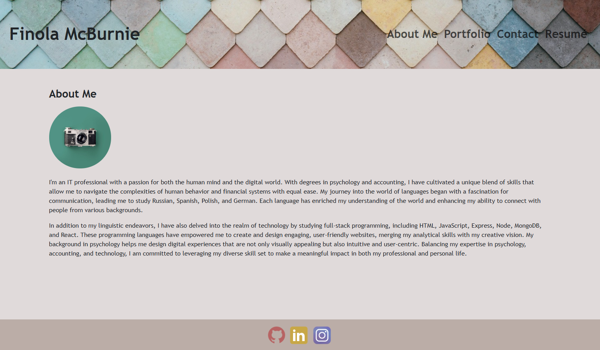
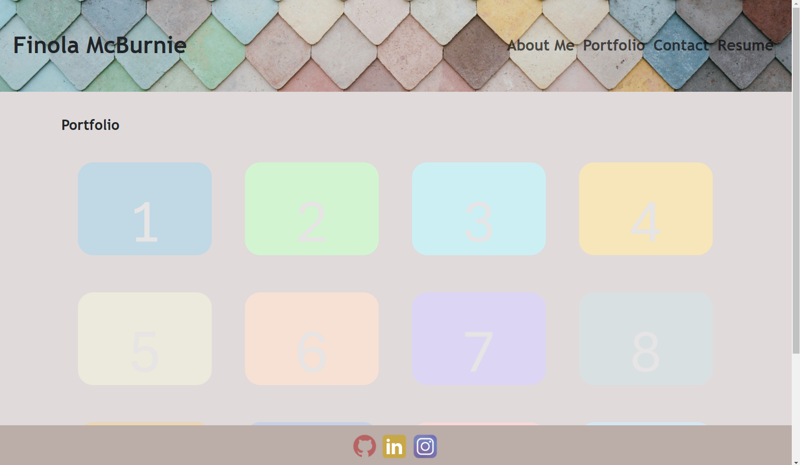
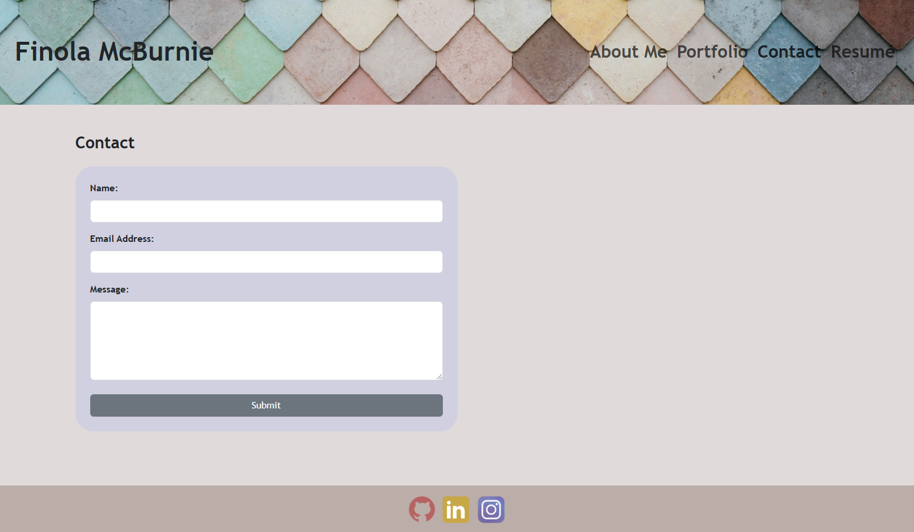
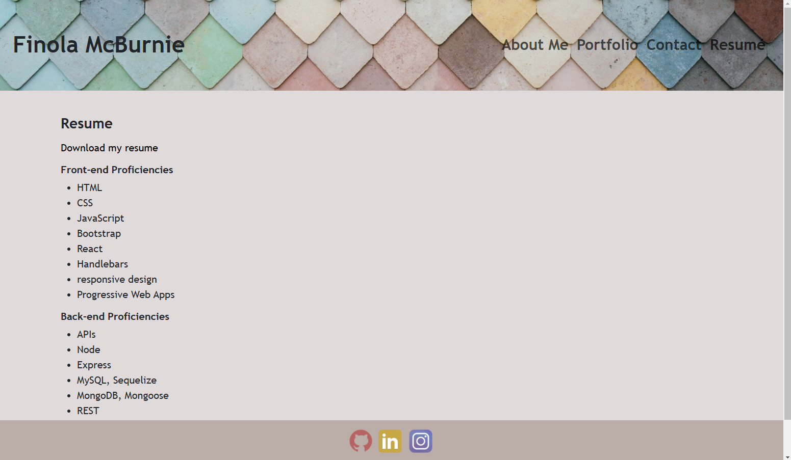

# 20c-React-Portfolio

## Table Of Contents

- [Description](#description)
- [Technologies Used](#technologiesused)
- [Installation](#installation)
- [Usage](#usage)
- [Credits](#credits)
- [License](#license)

## Description

A well-crafted coding portfolio is more than just a digital resume; it's a dynamic showcase of your skills and creativity. The React framework allows for the development of complex, single-page applications, enabling developers to present their projects in a user-friendly and engaging manner. A React-based portfolio can include features like smooth animations, interactive elements, and responsive design, demonstrating a strong grasp of modern web development techniques.

As a former CPA and current NetSuite Administrator learning web development, I've utilized React to create a portfolio that highlights my technical abilities and problem-solving skills. This portfolio serves as a testament to my commitment to continuous learning and my ability to apply new technologies to real-world projects. By showcasing a diverse range of projects, from simple static websites to complex web applications, I aim to demonstrate my versatility and potential as a skilled web developer.

## Technologies Used

-- React Framework
-- React Bootstrap
-- JavaScript
-- JSX
-- HTML
-- CSS
-- Netlify for deployment

## Installation

This app was built from scratch using Node, Express and the React Framework. To use the app locally, install Node.js to be used within your CLI. This portfolio app is also available at the Netflify link below.

Netlify deployment:
https://joyful-marzipan-ad3b73.netlify.app/

GitHub Repository:
https://github.com/qbres333/20c-React-Portfolio

## Usage

To run the app locally, enter the following commands in your CLI:
    -- npm run build
    -- npm run start
The link to the app will display as "http://localhost:5173/" in the CLI.

## Credits

React Links:
https://reactrouter.com/en/main/components/link

React Forms:
https://react-bootstrap.netlify.app/docs/forms/overview

React Forms Validation:
https://react-bootstrap.netlify.app/docs/forms/validation

React Bootstrap Installation:
https://react-bootstrap.netlify.app/docs/getting-started/introduction/

React Custom Components:
https://www.digitalocean.com/community/tutorials/how-to-create-custom-components-in-react

Using CSS Transitions:
https://developer.mozilla.org/en-US/docs/Web/CSS/CSS_transitions/Using_CSS_transitions

CSS Background-Image:
https://developer.mozilla.org/en-US/docs/Web/CSS/background-image

## License

MIT License - see the LICENSE file for details.